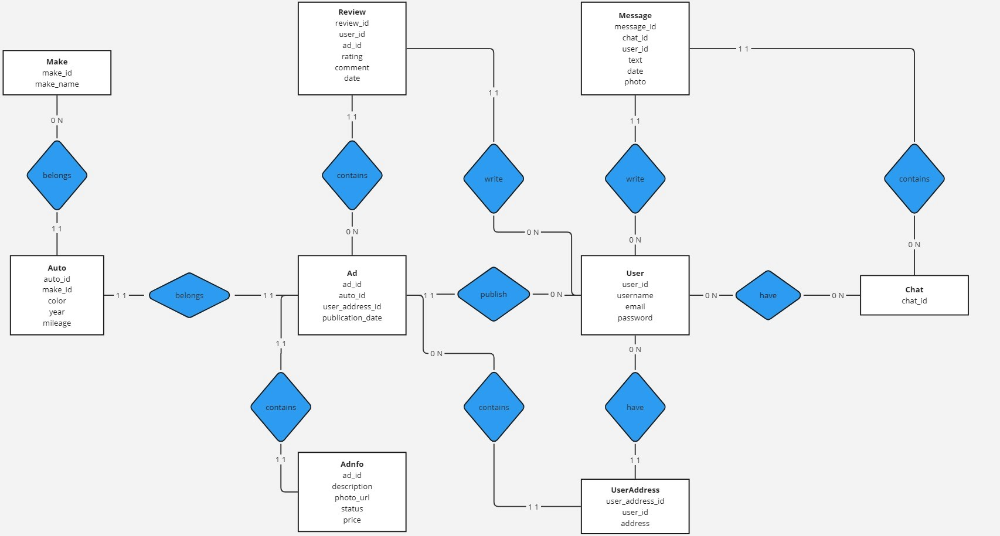
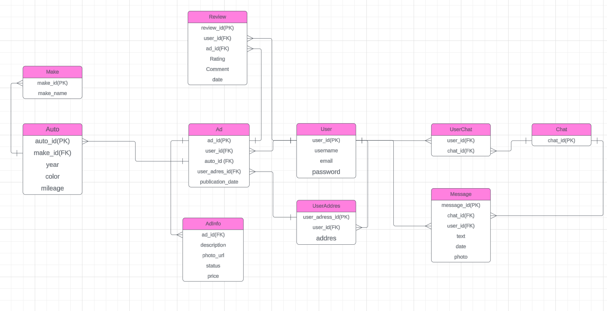

# Auto.ru Database Project

База данных для платформы объявлений о продаже автомобилей с полной реализацией на PostgreSQL.

## 🗄️ Модели базы данных

### Концептуальная модель

### Логическая модель  

## 📊 Структура БД

**Основные сущности:**
- **User** - пользователи системы (username, email, password)
- **Ad** - объявления о продаже (publication_date, статусы)
- **Auto** - транспортные средства (year, color, mileage)
- **Make** - марки автомобилей (Toyota, BMW, Volkswagen, etc.)
- **Review** - отзывы и рейтинги (rating 1-5, комментарии)
- **Chat/Message** - система общения между пользователями
- **UserAddress** - адреса пользователей
- **AdInfo** - дополнительная информация об объявлениях

## 🔗 Основные связи

- **User → Ad** (1 ко многим) - пользователь создает объявления
- **Ad → Auto** (многие к 1) - объявление о конкретном автомобиле
- **Auto → Make** (многие к 1) - классификация по маркам
- **User ↔ Chat** (многие ко многим) - пользователи в чатах
- **Ad → Review** (1 ко многим) - отзывы к объявлениям

## 🛠️ Технологии

- PostgreSQL
- Python (psycopg2, faker для генерации тестовых данных)
- SQLAlchemy

## 📁 Файлы проекта

- `main.py` - заполнение базы данных тестовыми данными
- `auto_rusql` - скрипты создания таблиц
- `auto_ru_database_report.pdf` - полный отчет по проекту
- `concept.jpg` - концептуальная модель данных
- `logic.png` - логическая модель данных

## 🎯 Возможности системы

- Поиск и фильтрация объявлений
- Система рейтингов и отзывов
- Мессенджер между пользователями
- Аналитика продаж и статистика
- Управление пользовательскими профилями

## 📋 Примеры запросов

В проекте реализовано 13 сложных SQL-запросов для аналитики:
- Поиск актуальных объявлений продавца
- Анализ отзывов по маркам
- Статистика по ценам и рейтингам
- Поиск по текстовым описаниям
- И многое другое

Проект демонстрирует полный цикл разработки БД: от концептуального проектирования до сложных аналитических запросов.
